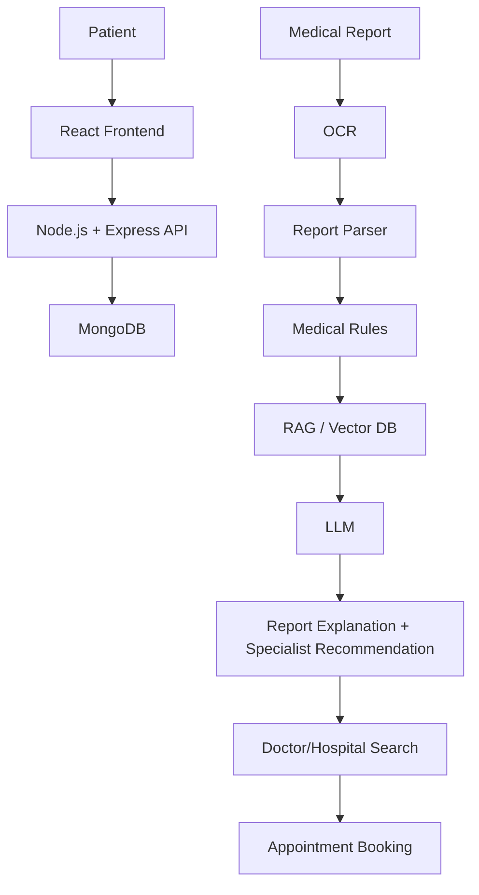

# BookMyAppointment AI

## Project Overview

BookMyAppointment AI is an AI-assisted healthcare platform that connects medical report analysis, symptom-based specialist recommendation, hospital/doctor discovery and appointment booking.

## Problem

Patients often struggle to understand medical reports, identify the right specialist, and find nearby doctors or hospitals with available time slots. This platform reduces that friction by combining report OCR, configurable medical rules, specialist recommendation, and appointment booking in one workflow.

## Objectives

- Help patients register, log in and manage their healthcare journey.
- Let patients choose a location and search nearby hospitals and doctors.
- Recommend an appropriate specialist from symptoms and report findings.
- Support PDF and image report uploads with OCR and structured extraction.
- Compare values across multiple reports with health trend charts.
- Let patients book, confirm and cancel appointments.
- Provide dashboards for patients, doctors and hospital admins.
- Keep the system informational and not diagnostic.

## How We Built It

1. Built React frontend.
2. Created Node.js/Express backend.
3. Implemented JWT authentication.
4. Added patient, doctor and hospital roles.
5. Added location-based hospital/doctor search.
6. Implemented symptom-based specialist recommendation.
7. Added PDF/image medical report upload.
8. Implemented OCR for extracting report text.
9. Parsed medical parameters from reports.
10. Added configurable reference-range/rule checks.
11. Integrated LLM for simple report explanations.
12. Created embeddings from trusted knowledge.
13. Stored embeddings in a vector database.
14. Implemented RAG for retrieving relevant information.
15. Added previous-report comparison and graphs.
16. Implemented doctor/hospital appointment booking.
17. Added doctor availability and time-slot management.
18. Added report upload by both patients and hospitals/doctors.
19. Added role-based access control and secure report access.

## Architecture



## Main Features

- Patient authentication and profile management.
- Role-based dashboards for patient, doctor and hospital admin.
- Location-aware hospital and doctor search.
- Symptom-based specialist recommendation.
- Medical report upload and OCR processing.
- Extracted parameter display and abnormal-value highlighting.
- Simple English report summary with optional Telugu support via API configuration.
- Health trend comparison with charts.
- Appointment booking with double-booking protection.
- Appointment history and cancellation.
- Secure report access and protected APIs.

## User Roles

### Patient

Register/login, choose a location, enter symptoms, upload reports, compare reports, book appointments, view history and receive confirmation.

### Doctor

View appointments, update availability, review patient reports when permitted, upload reports and manage notes.

### Hospital Admin

Manage hospital profile, doctors, departments, availability and appointment slots.

## AI/RAG Pipeline

Upload → OCR → Extraction → Rules → Embedding/Retrieval → LLM → Result

The server uses a modular AI pipeline so the vector store or LLM provider can be replaced later without changing the main application.

## Appointment Booking

The patient selects a hospital, doctor, date and available time slot. The backend prevents double booking on the same doctor/date/time combination and generates a unique appointment ID.

## Location

Patients can use manual city/state/area/pincode selection. The backend exposes hospital and doctor search endpoints that filter by location fields and text query.

## Medical Report Analysis

Patients and providers can upload reports in PDF, JPG, JPEG and PNG formats. OCR extracts text, the parser pulls key parameters, reference ranges are checked from configurable data, and the LLM layer generates a grounded explanation.

## Health Trends

The backend groups supported parameters across reports so the frontend can compare values over time. The charts show neutral wording such as value changes over time instead of making unsupported medical claims.

## Technology Stack

| Layer | Technology |
| --- | --- |
| Frontend | React, Vite, Tailwind CSS, React Router, Axios, Lucide React, Recharts |
| Backend | Node.js, Express.js |
| Database | MongoDB, Mongoose |
| Authentication | JWT, bcryptjs |
| File Storage | Cloudinary with local fallback |
| OCR | Tesseract OCR with PDF support |
| AI | OpenAI API or Gemini API via environment variables |
| Vector/RAG | Modular local vector store abstraction |
| Validation | Zod |

## API Documentation

### Authentication

- `POST /api/auth/register`
- `POST /api/auth/login`

### Users

- `GET /api/users/profile`
- `PUT /api/users/profile`

### Reports

- `POST /api/reports/upload`
- `GET /api/reports/:id`
- `GET /api/reports/user/:userId`
- `POST /api/reports/:id/analyze`

### Symptoms and AI

- `POST /api/symptoms/recommend-specialist`
- `POST /api/ai/analyze-report`
- `POST /api/ai/recommend-specialist`

### Hospitals and Doctors

- `GET /api/hospitals`
- `GET /api/hospitals/:id`
- `GET /api/doctors`
- `GET /api/doctors/:id`
- `PATCH /api/doctors/:id/availability`

### Appointments

- `GET /api/appointments`
- `POST /api/appointments/book`
- `GET /api/appointments/:id`
- `PATCH /api/appointments/:id/cancel`

### Health Trends

- `GET /api/health-trends/:patientId`

## Database Collections

- `Users`
- `Doctors`
- `Hospitals`
- `MedicalReports`
- `Appointments`
- `MedicalKnowledge`
- `HealthTrends`

## Environment Variables

Create a `.env` file from `.env.example`.

```bash
PORT=5000
NODE_ENV=development
MONGODB_URI=mongodb://127.0.0.1:27017/bookmyappointment_ai
JWT_SECRET=change_this_secret
JWT_EXPIRES_IN=7d
CORS_ORIGIN=http://localhost:5173
CLOUDINARY_CLOUD_NAME=
CLOUDINARY_API_KEY=
CLOUDINARY_API_SECRET=
CLOUDINARY_UPLOAD_FOLDER=bookmyappointment-ai
OPENAI_API_KEY=
OPENAI_MODEL=gpt-4o-mini
GEMINI_API_KEY=
GEMINI_MODEL=gemini-1.5-flash
GOOGLE_MAPS_API_KEY=
```

## Installation

Install dependencies:

```bash
npm install
npm install --prefix server
npm install --prefix client
```

Run the backend:

```bash
npm run dev --prefix server
```

Run the frontend:

```bash
npm run dev --prefix client
```

Run both together from the root workspace:

```bash
npm run dev
```

Seed demo data:

```bash
npm run seed --prefix server
```

## GitHub Pages Deployment

The frontend can be deployed to GitHub Pages as a static site. The backend should stay deployed on Render or another Node host.

Steps:

1. Deploy the backend to Render first and copy the public API URL.
2. In the GitHub repository settings, enable GitHub Pages from GitHub Actions.
3. Set the repository variable `VITE_API_BASE_URL` to your live backend API, for example `https://bookmyappointment-ai-api.onrender.com/api`.
4. Push to `main`; the workflow in `.github/workflows/deploy-pages.yml` will build and publish the client automatically.

The published GitHub Pages site will use hash-based routing so refreshes and deep links continue to work.

## Folder Structure

```text
BookMyAppointment/
  client/
    src/
      components/
      context/
      layouts/
      pages/
      routes/
      services/
      utils/
  server/
    ai/
      embeddings/
      ocr/
      prompts/
      rag/
      reportParser/
      specialistRecommendation/
      vectorStore/
    config/
    controllers/
    middleware/
    models/
    routes/
    seed/
    services/
    uploads/
    utils/
```

## Future Scope

- More report types
- More regional languages
- Hospital EMR integration
- Wearable integration
- Doctor dashboard improvements
- Real-time appointment availability

## Safety Disclaimer

This application is an AI-assisted informational tool. It does not provide a medical diagnosis or replace a licensed healthcare professional. Users should consult a qualified healthcare professional for diagnosis, treatment and medical decisions.
